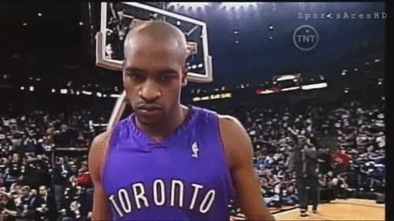

# [fit] Getting Started	  
# [fit] With _**iOS**_

--- 

# __*Austin Lamon*__
### iOS Developer @ Capital One

--- 

---

# [fit] Yeah, I don't care...
## Tell me more about _**iOS**_...

---

# _**Barriers to Entry**_
- Mac (Yosemite or later)
- Swift (now up to 2.2)
- Xcode (now up to 7.3)
- iOS frameworks (e.g. UIKit)
- $99/year to run your app on a device/submit to App Store

---

--- 

## [fit] Just Kidding... It's Getting Better!
- $99 is now _only_ required for App Store submission
- The Equalizer -- the _**Swift**_ transition
	- Released at WWDC June, 2014 (watchOS, tvOS)
	- Simpler, more concise, safer

---

---

## [fit] It's Funner

---

## [fit] _**FOUNDATIONAL**_
## [fit] _**CONCEPTS**_

---

## [fit] _**MVC**_
- Model: Encapsulates the data specific to an app
- View: Visual components availed to the user
- Controller: The brain. Contains the “glue” code between our views and models 

---

---

## [fit] _**Storyboards**_
- Visually lay out your app’s scenes and the user’s path
- Scene == View == Screen
	- Has subviews (buttons, labels, text, etc)
- Tied to an instance of a _UIViewController_

--- 

## [fit] What Really Matters?
- _Model_ == Data
- _ViewControllers_ == Logic
- _Views_ == Visual/Storyboard

---

# [fit] SAMPLE
# [fit] APP
### _**(show me code)**_

---

## [fit] " They don't want us to do pushups "
## _**-- DJ Khaled**_

#### Basis of this app was poached from Jared Alexander -- Capital One Labs

---

# [fit] Next Steps?
- Backend integration
- watchOS?
- tvOS?
- _**Keep Learning -- Build Anything**_

---

___

# [fit] _**Resources**_
- Ray Wenderlich Tutorials (raywenderlich.com)
- Stanford iOS Class (itunes.apple.com/us/course/developing-ios-8-apps-swift/id961180099)
- developer.apple.com

---

# [fit] HackPrinceton Help?
## [fit] _**@austin\_lamon**_

---

